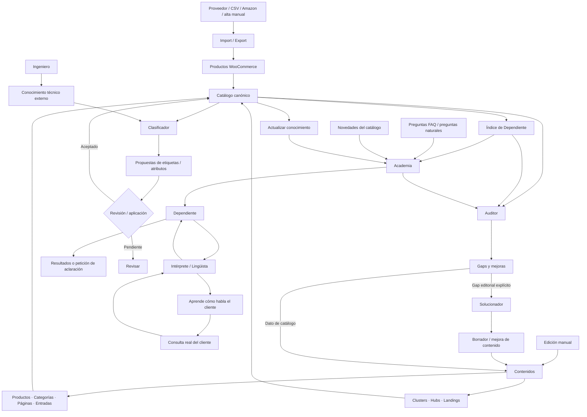

# Inicio

Ruta: **SEO Taxonomy → Inicio**

La pantalla Inicio es el punto de entrada al plugin. No modifica datos por sí misma: presenta el objetivo del sistema, un flujo de trabajo recomendado y accesos directos.

## Tarjetas visibles

| Tarjeta | Qué abre | Acción |
|---|---|---|
| Productos | Gestión del catálogo WooCommerce | **Abrir** [Consulta] |
| Categorías | Categorías, arquitectura e inventarios | **Abrir** [Consulta] |
| Páginas | Estructura SEO, landings y corporativas | **Abrir** [Consulta] |
| Entradas | Posts, oportunidades y errores | **Abrir** [Consulta] |
| Imágenes | Inventario, anomalías y asignación | **Abrir** [Consulta] |
| Informes | Informes, anomalías y Analista | **Abrir** [Consulta] |
| Herramientas | Servicios avanzados del plugin | **Abrir** [Consulta] |

El botón **Abrir** solo navega a la pantalla correspondiente.

## Procedimiento recomendado mostrado en Inicio

La guía de Inicio recuerda el orden general: crear/publicar contenido, asignar su función, relacionarlo con Taxonomy, asociar categorías cuando corresponda, comprobar productos y después revisar informes y mejoras. Es una orientación; no ejecuta esos pasos automáticamente.

## Mapa de servicios

| Servicio | Función |
|---|---|
| Import / Export | Incorpora productos, categorías, páginas, entradas y datos de proveedores. |
| Contenidos | Edita productos, categorías, páginas, clusters/hubs, entradas e imágenes. |
| Dependiente | Resuelve necesidades del cliente usando catálogo, semántica, ranking y conocimiento aprendido. |
| Academia | Forma y actualiza a Dependiente con catálogo, contenido, preguntas y novedades. |
| Intérprete / Lingüista | Aprende cómo pregunta el cliente y convierte lenguaje natural en estructura semántica. |
| Ingeniero | Investiga conocimiento técnico externo por categoría, con fuente, evidencia y confianza. |
| Clasificador | Detecta huecos y propone etiquetas y atributos canónicos; solo cambia datos cuando se confirma o aplica. |
| Auditor | Mide calidad, cobertura, coherencia, arquitectura, índice y aprendizaje; sus hallazgos son señales de revisión. |
| Solucionador | Convierte necesidades y gaps editoriales explícitos en propuestas o borradores; no publica automáticamente. |

## Flujo general de información

### Lectura rápida

**Importamos o editamos → consolidamos el catálogo → Academia enseña a Dependiente → Intérprete aprende el lenguaje del cliente → Ingeniero aporta evidencia técnica → Clasificador la estructura y propone cambios → Auditor detecta huecos → Solucionador y los editores de catálogo corrigen → Dependiente vuelve a actualizarse.**

Reglas importantes:

- **Ingeniero no escribe directamente en Dependiente**: su conocimiento llega a catálogo cuando se estructura y se acepta.
- **Clasificador propone antes de modificar**: una propuesta no es conocimiento canónico hasta que se aplica.
- **Auditor no corrige automáticamente**: señala huecos y anomalías para revisión.
- **Intérprete no aprende catálogo ni respuestas**: aprende cómo habla el cliente; catálogo y Vocabulary siguen siendo la verdad.
- **Academia es el puente de aprendizaje de Dependiente**: estudia el catálogo inicial, las preguntas y las actualizaciones posteriores.
