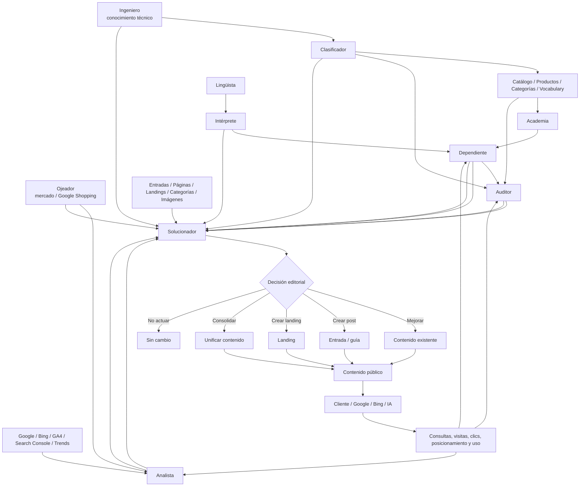

# Flujo de datos

Esta página resume el flujo de conocimiento y decisión editorial de SEO Taxonomy. Debe usarse como referencia para evitar duplicar responsabilidades entre servicios.

## Lectura del flujo

1. **Academia** forma a Dependiente.
2. **Intérprete/Lingüista** permiten comprender cómo pregunta el cliente.
3. **Ingeniero** aporta conocimiento técnico y **Clasificador** lo estructura cuando corresponde.
4. **Auditor** analiza calidad, cobertura y coherencia interna.
5. **Analista** interpreta demanda, rendimiento y mercado.
6. **Ojeador** aporta observación externa del mercado.
7. **Solucionador** reúne estas conclusiones junto con el inventario real de contenidos.
8. Solucionador decide si hay que crear, mejorar, consolidar o no actuar.
9. Entradas, Páginas, Categorías e Imágenes ejecutan los cambios.
10. El rendimiento posterior vuelve a alimentar Analista, Auditor, Dependiente y finalmente una nueva decisión de Solucionador.

## Regla de arquitectura

**Cada servicio produce su dato; Solucionador concentra la decisión editorial.**

No se deben crear sistemas paralelos de análisis en Entradas, Páginas, Categorías o Landings si la misma información puede centralizarse en Solucionador.
